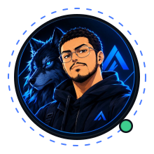

  

 

 

  

### LOOKING FOR A FULL-STACK OR DEVOPS ENGINEER? LET'S TALK.

 

> "I build software. I'm learning to run it." — Full-stack engineer with real production-ops instincts, self-teaching DevOps every week to close the gap.

 

## About me

<table>
<tr><td width="160"><b>ROLE</b></td><td>Shipping features with AI-assisted development workflows @ <b>Vizyo-Agency</b></td></tr>
<tr><td><b>EDUCATION</b></td><td>M.Sc. in Decision Support &amp; Intelligent Systems — University of Oran 1</td></tr>
<tr><td><b>OPS BACKGROUND</b></td><td>3 years running production POS &amp; network systems in a live retail environment</td></tr>
<tr><td><b>IMPACT</b></td><td>Master's thesis ML optimization system — <b>+20% supply-chain efficiency</b></td></tr>
<tr><td><b>BUILDING NOW</b></td><td>Docker · CI/CD · Linux · Cloud fundamentals — self-taught, every week</td></tr>
<tr><td><b>LANGUAGES</b></td><td>Arabic · French · English</td></tr>
</table>

 

## Now → Next

<table align="center">
<tr>
<th>🟦 Now — Full-Stack Developer</th>
<th>🟧 Next — DevOps Engineer</th>
</tr>
<tr>
<td>Django, DRF &amp; React APIs shipped end to end</td>
<td>Docker &amp; containerized deployments</td>
</tr>
<tr>
<td>AI-assisted development workflows, in production</td>
<td>CI/CD pipelines, built and maintained</td>
</tr>
<tr>
<td>3 years operating live retail infrastructure</td>
<td>Linux administration &amp; cloud fundamentals</td>
</tr>
</table>

 

## Stack

 

© 2026 Ali Atmani · <a href="https://atmaniali.github.io/portfolio-ali.atmani/">Portfolio</a>

